# Ship Deployment Service

A resilient, enterprise-grade deployment service that manages Docker container deployments on remote "ships" (edge devices/servers) with automatic updates, health monitoring, and robust error handling using Polly resilience patterns.

## 🏗️ Architecture Overview


## 🚀 Key Features

### 1. **Automated Deployment Management**
- Polls HQ server for pending deployments every 5 minutes
- Automatically pulls, stops, and starts containers
- Tracks deployment status throughout the lifecycle

### 2. **Resilience & Reliability**
- **Polly-powered retry mechanisms** for network operations
- **Exponential backoff** with jitter to prevent thundering herd
- **Configurable timeouts** and retry policies
- **Circuit breaker patterns** ready for implementation

### 3. **Health Monitoring**
- Continuous health checks on deployed containers
- Heartbeat mechanism with HQ server
- Container state verification
- Deployment status tracking

### 4. **Configuration Management**
- Environment-specific settings via `appsettings.json`
- Secure credential management
- Docker registry authentication
- Configurable retry policies

## 📋 System Components

### Core Service Architecture


## 🔄 Deployment Flow


## 🛡️ Resilience Features

### HTTP Operations Resilience


### Image Pull Resilience

```mermaid
graph LR
    A[Pull Request] --> B{Execute}
    B -->|Success| C[Image Available]
    B -->|Network Error| D[Retry Logic]
    D --> E[Wait 2s → 4s → 8s]
    E --> F[Retry Pull]
    F --> B
    B -->|Auth Error| G[Fatal Error]
    
    subgraph "Pull Policy"
        H[Max 3 Retries]
        I[2s Base Delay]
        J[Max 30s Delay]
        K[10min Timeout]
    end
```



## ⚙️ Configuration

### Application Settings Structure

```json
{
  "ShipId": "SHIP-001",
  "HqApiUrl": "https://your-hq-server.com",
  "DockerRegistry": {
    "Username": "registryUsername",
    "Password": "registryPassword",
    "PullRetryConfig": {
      "MaxRetries": 3,
      "BaseDelayMs": 2000,
      "MaxDelayMs": 30000,
      "TimeoutMinutes": 10
    }
  },
  "HttpClient": {
    "RetryConfig": {
      "MaxRetries": 3,
      "BaseDelayMs": 1000,
      "MaxDelayMs": 10000,
      "TimeoutSeconds": 30
    }
  }
}
```

### Environment Variables Support

- `ASPNETCORE_ENVIRONMENT` - Environment (Development/Production)
- `SHIP_ID` - Override default ship identifier
- `HQ_API_URL` - Override HQ server URL
- Registry credentials via environment variables for security

## 🔧 Docker Container Configuration

### Container Specifications

```yaml
Container Settings:
  Name: employeemanagement
  Memory: 2GB
  CPU: 2 cores
  Port Mapping: 8080:80
  Restart Policy: unless-stopped
  
Health Check:
  Command: curl -f http://localhost:80/health
  Interval: 30s
  Timeout: 10s
  Retries: 3
  Start Period: 30s

Volume Mounts:
  - C:\EmployeeData:/app/data

Environment Variables:
  - ASPNETCORE_ENVIRONMENT=Production
  - ASPNETCORE_URLS=http://+:80
  - DOTNET_RUNNING_IN_CONTAINER=true
  - DEPLOYMENT_ID={deployment-id}
  - DEPLOYMENT_VERSION={image-tag}
  - DEPLOYMENT_TIMESTAMP={timestamp}
  - DEPLOYED_BY=ralphmx1988
```

## 📊 Monitoring & Logging

### Log Levels & Categories


### Structured Logging

```json
{
  "timestamp": "2025-07-29T10:30:00Z",
  "level": "Information",
  "message": "Processing deployment {DeploymentId} - {ImagePath}",
  "properties": {
    "DeploymentId": "dep-123",
    "ImagePath": "myregistry.azurecr.io/app:v2.1.0",
    "ShipId": "SHIP-001"
  }
}
```

## 🚦 Deployment States


## 🔒 Security Features

### Credential Management
- **Registry Authentication**: Secure Docker registry access
- **Configuration Encryption**: Sensitive data protection
- **User Secrets**: Development environment security
- **Environment Variables**: Production credential injection

### Network Security
- **HTTPS Communication**: Encrypted API communication
- **Timeout Protection**: Prevents hanging connections
- **Retry Limits**: Prevents DOS scenarios
- **Jitter Implementation**: Reduces coordinated retry storms

## 📦 Installation & Setup

### Prerequisites

```bash
# Required Software
- .NET 9.0 SDK
- Docker Desktop (Windows)
- Windows Service support
- Network access to HQ server
- Container registry access
```

### Installation Steps

1. **Clone Repository**
```bash
git clone https://github.com/ralphmx1988/Ship.DeploymentService.git
cd Ship.DeploymentService
```

2. **Configure Settings**
```bash
# Edit appsettings.json
# Set ShipId, HqApiUrl, and registry credentials
```

3. **Build & Install**
```bash
dotnet build
dotnet publish -c Release
# Install as Windows Service
```

4. **Start Service**
```bash
sc start ShipDeploymentService
```

## 🧪 Testing & Validation

### Health Check Endpoints

- **Container Health**: `GET http://localhost:8080/health`
- **Service Status**: Check Windows Service status
- **Log Monitoring**: Review service logs in `C:\ShipLogs\`

### Common Scenarios

1. **Network Interruption**: Service automatically retries
2. **Registry Downtime**: Exponential backoff with max delays
3. **Container Failures**: Automatic rollback and status reporting
4. **HQ Server Issues**: Continues operation, retries on recovery

## 🔮 Future Enhancements

### Planned Features

- **Circuit Breaker**: Fail-fast for consistently failing operations
- **Metrics Collection**: Prometheus/Grafana integration
- **Blue-Green Deployments**: Zero-downtime deployments
- **Multi-Container Support**: Orchestrated container deployments
- **Backup & Recovery**: Automatic data backup before deployments

### Scalability Considerations

- **Load Balancing**: Multiple ship support per registry
- **Caching**: Image layer caching for faster pulls
- **Compression**: Optimized network usage
- **Parallel Processing**: Concurrent deployment support

## 📞 Support & Troubleshooting

### Common Issues

| Issue | Cause | Solution |
|-------|-------|----------|
| Image pull fails | Network/Auth | Check credentials & connectivity |
| Container won't start | Resource limits | Review memory/CPU allocation |
| Heartbeat failures | HQ server down | Service will retry automatically |
| Status update fails | API issues | Check HQ server logs |

### Log Analysis

```bash
# View recent logs
Get-Content "C:\ShipLogs\ship-service-*.log" -Tail 100

# Filter by deployment
Select-String -Path "C:\ShipLogs\*.log" -Pattern "DeploymentId.*dep-123"

# Monitor real-time
Get-Content "C:\ShipLogs\ship-service-*.log" -Wait
```

## 🤝 Contributing

1. Fork the repository
2. Create feature branch (`git checkout -b feature/amazing-feature`)
3. Commit changes (`git commit -m 'Add amazing feature'`)
4. Push to branch (`git push origin feature/amazing-feature`)
5. Open Pull Request


## 🙏 Acknowledgments

- **Polly**: Resilience framework for .NET
- **Docker.DotNet**: Docker API client
- **Serilog**: Structured logging
- **Microsoft Extensions**: Hosting and configuration

